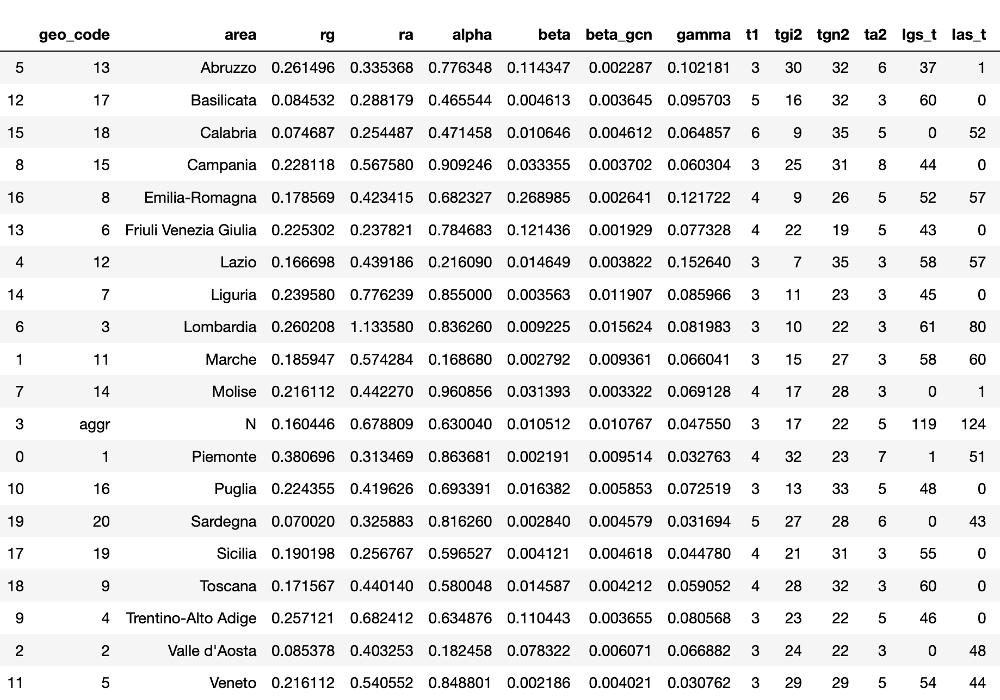
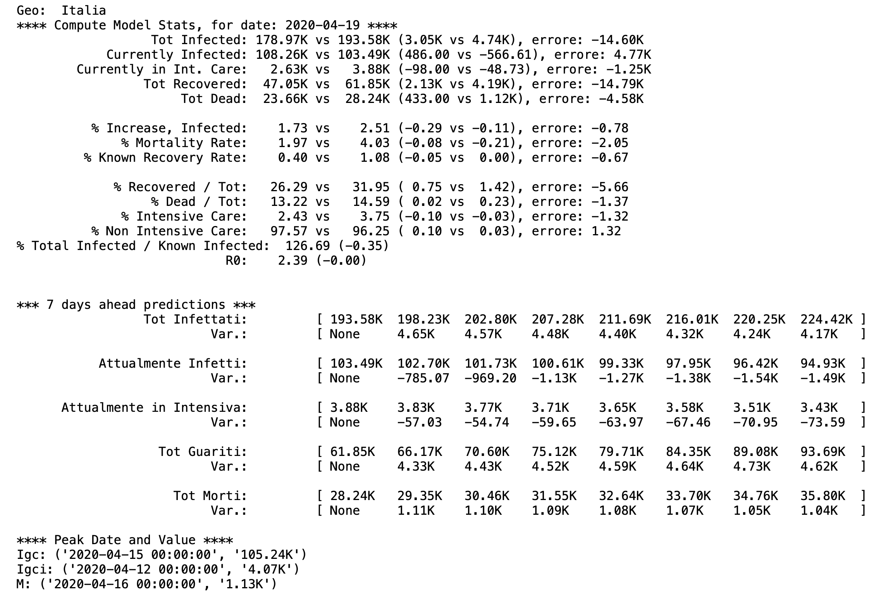
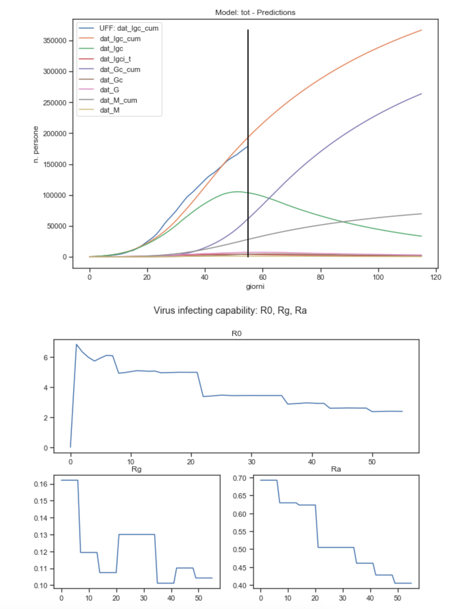
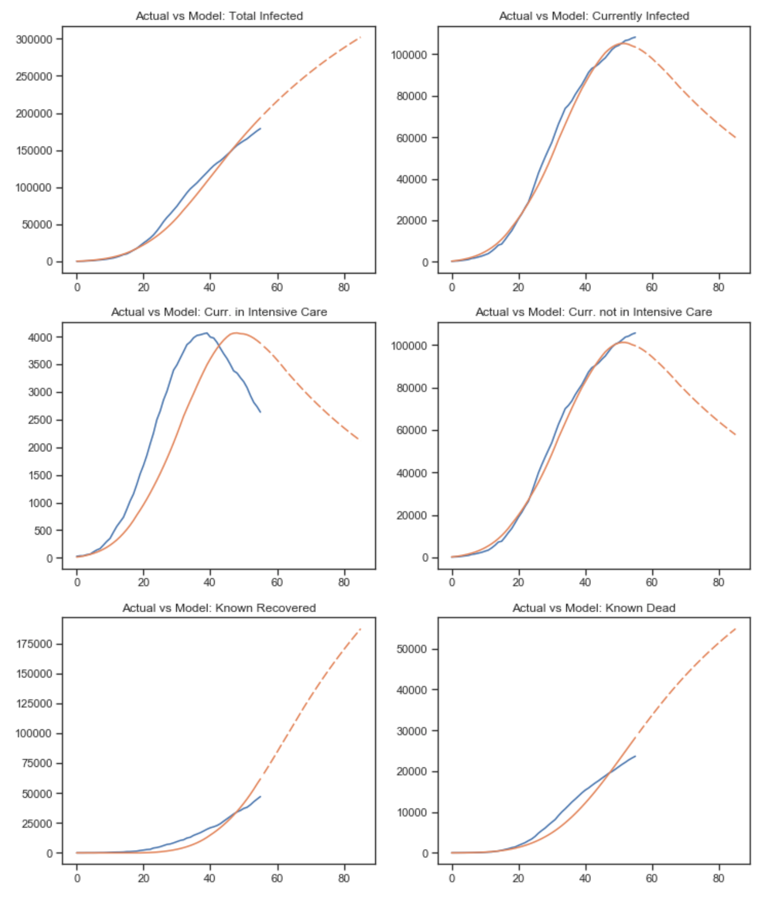
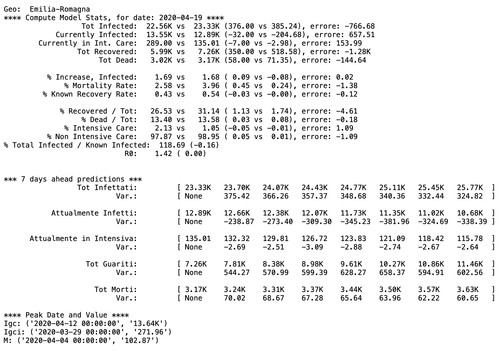
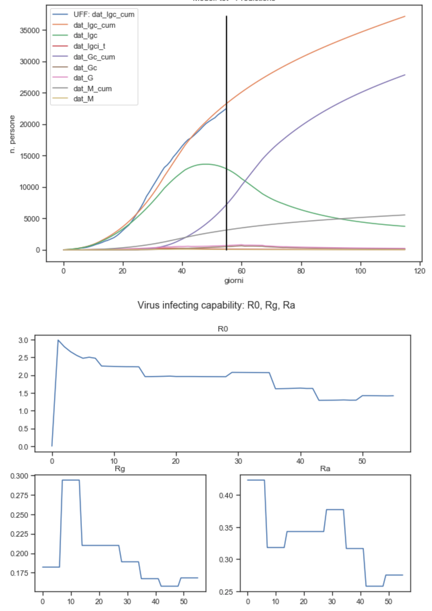
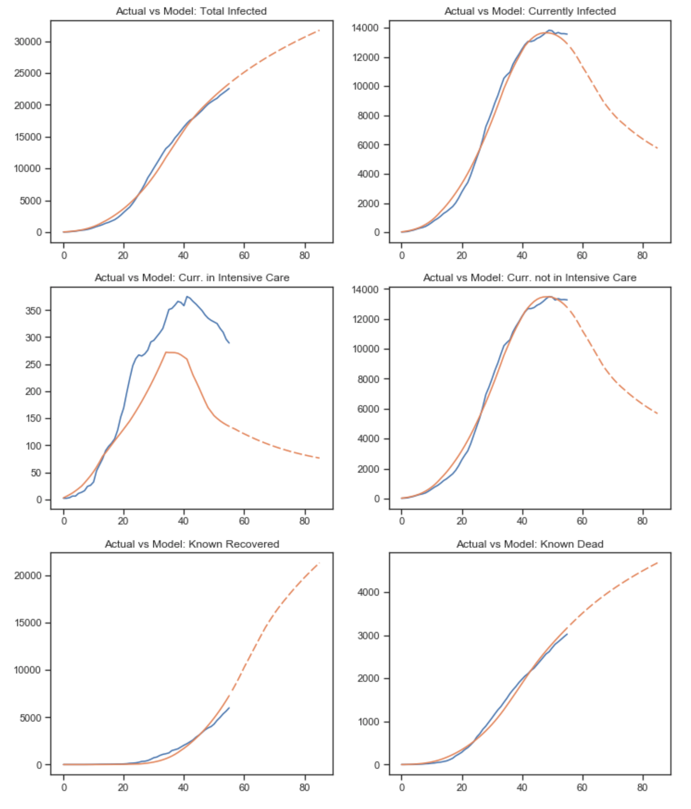
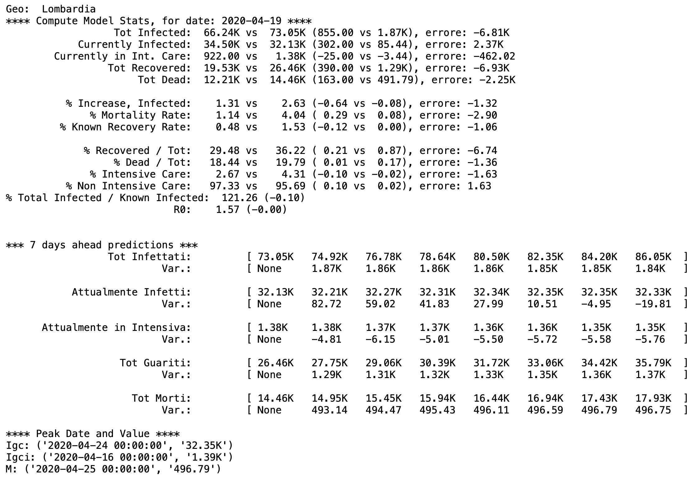
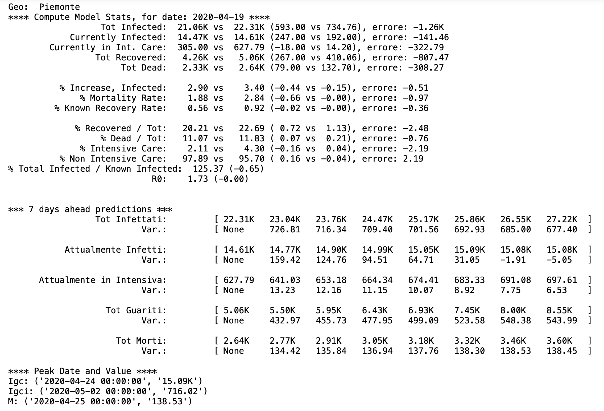

# Covid-9 Evolution Model - Calibration results

Here is the results of an calibration exercise based on Italian data as of April, 19th. I'll present the results of the 
calibration only, mathematical details of the model and a general description of variables and calibration strategy are described 
[here](https://raffaelelillo.blog/2020/03/29/covid-19-evolutionary-model-study-on-italy/); the code of the model, saved results and notebooks are available at this [github repository](https://github.com/lilloraffa/covid19-model)

## Results
In what follows, I'll consider only the model optimized for a composite error measure, considering major KPIs involved.
Moreover, I've also estimated the model for every Italian region to study differences in estimated parameters and in the
evolution of the contagion. For practical reason, I'll focus on only two regions, Emilia Romagna, Lombardia and Piemonte,
and I'll post graphs and analysis by region in the following [Jupyter Notebook](xxxx) that I'll try to update on a regular 
basis.

In general, the dynamics resulting from the Italy model may be affected by the different "maturity" and 
conditions of the contagion in each regions. Moreover, the model is highly sensitive to rg and ra parameters: to project
into the future their values and provide predicions the model makes the hypotesis that rg and ra are the same as the last 
observed value (actually average of the last two windows to avoid possible excessive oscillations of the last window).

Lastly, it seems to me that the ability of the model to mimic the shape of the KPIs curves is quite impressive: they are
not derived from regression / curve fitting (with which it easier to provide very close mimic of the observed values by
increasing the order of the polynomial of the fitted curve, with evident overfitting issues), but from the intrinsic 
logic of the math model that governs the relations between variables (see graphs below).

### Model Calibration and Parameters Analysis
The estimated parameters from the calibration are shown in the table below, from which we can try to tell the "story of 
the virus lifecycle". If a person gets infected and is asymptomatic, she will be infecting 0.45 (ra, median) people per day, 
for 4 days (ta2), after which she'll be recovered and never be infecting again. On the contrary, if she is symptomatic, 
she'll infect other 0.09 (rg) people per day for 4 days (t1). The new infected from either asymptomatic or symptomatic 
will be herself symptomatic with a probability of 80%. After t1, the symptomatics will get severely infected, 10% of 
them will go in intensive care, where they'll stay for 10-14 days until recovering. During this period, they may die each
day with a probability of 2-5% per day. The remaining 90% will be either staying home or hospedalized for about 28 days 
until recovery. During this period, they my die with a probability of 0.5% per day.

### Italy
The National model estimates a peak in the number of currently infected people of 105.24K on April 15th (vs the current 
value of 108.26K cases reported as of April 19th). The Currently Infected people is estimated quite effectively, with 
with a difference of 4.4% from the actual value, while mortality and recovery rate are a bit overestimated. The constant
decrease in the number of Recovered in intensive care is also quite well captured. Finally, the model estimates ar R0 of
2.39 and the total number of infected people (the ones known from ufficial statistics plus the ones unknown) is 1.26 
times the number of known ones (quite low compared to what seems to be the general understanding).
The following picture sums up the key statistics and kpi of the model on April 19th. One note on the evolution curves 
shown in picture "Model: tot - Prediction": the curve of Currently Infected (Igc_cum, green line) has flattened quite 
significantly (much lower peak, much flatter right tail). This is a clear evidence of the effect of the lock down 
measure mentioned above.

### Emilia Romagna
The calibration has done a good job for Emilia Romagna: both delta vs actual data and structural kpi (e.g. 
Mortality rate, % Increase in infected, % Recovered / Tot, % Dead / Tot, etc.) seems to be quite close to reality. 
To notice: Emilia Romagna showed a constant decrease in R0, with an initial peak that is below the national value.
The model predicts a peak in currently infected of 13.6K on April 12th, a more gentile peak in Intensive Care of 271 on
March 29th, and a peak in daily deads of 103 on April 4th.

For the other regions, I'll avoid to comment so not to be too repetitive, as all info are in the graphs.

### Lombardia
Few remarks: R0 is still a bit higher than most of the other regions, at 1.57. There seems to be something strange in
the sudden drop in Intensive care on the one hand, meanwhile on the other hand recovery and death seems to be lower than
what the model predicts.

### Piemonte
Remarks: quite hight R0 at 1.73; all KPIs are well represented by the model, but the number of Intensive Care.

